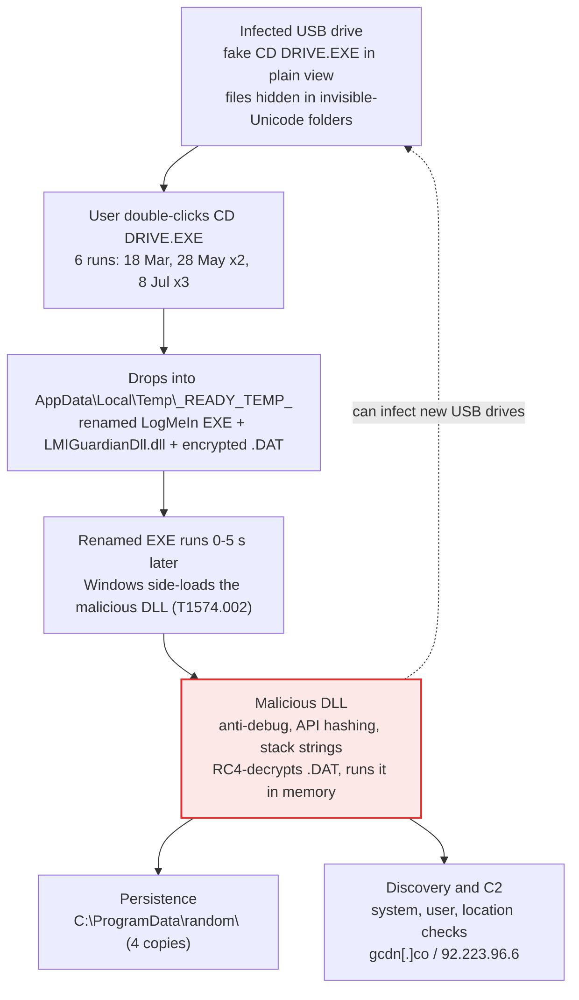
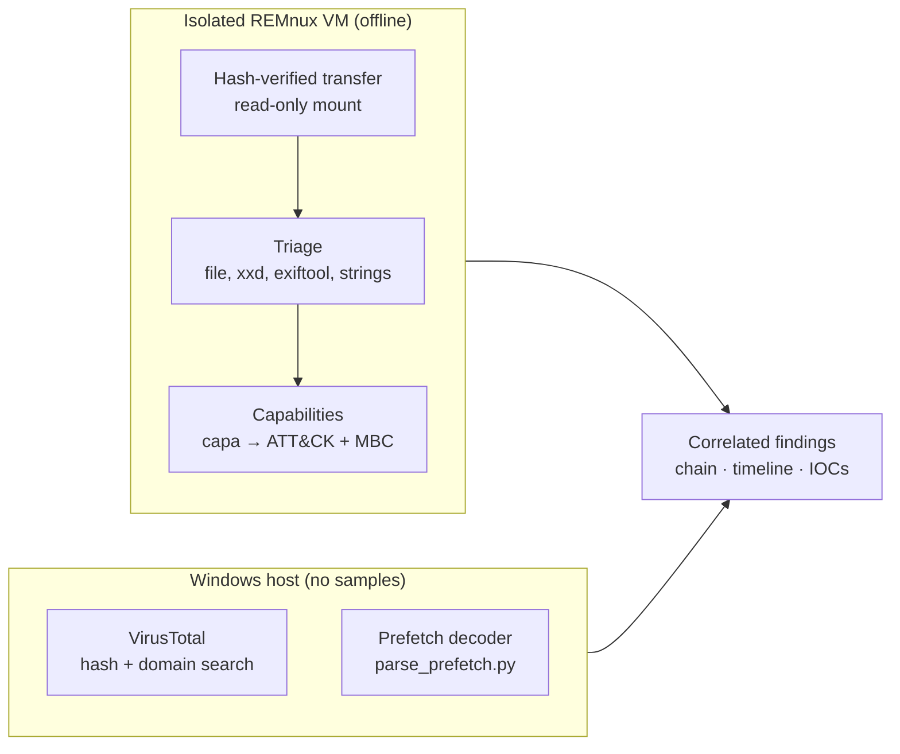
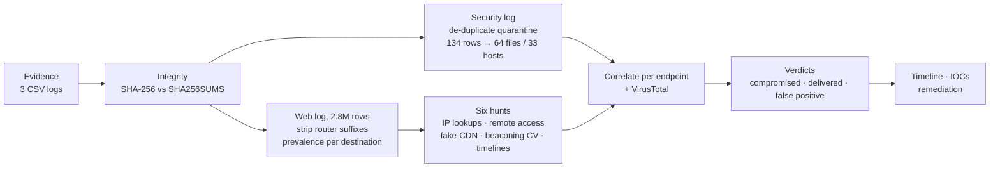

# AICTE × Eastern Command — Cyber Security Selection Challenges

Three hands-on investigations completed for the **AICTE National Internship – Eastern Command (Kolkata)** selection process: malware analysis, endpoint log forensics and signal intelligence.

**Author:** Aditya Narayan · B.Tech CSE, Institute of Engineering and Management, Kolkata


---

## Overview

| # | Challenge | Domain | Headline result | Status |
|---|-----------|--------|-----------------|--------|
| 1 | [Malware analysis](#-challenge-1--malware-analysis) | Static malware analysis · DFIR | USB worm using DLL side-loading; infection chain rebuilt from Prefetch | ✅ |
| 2 | [Log analysis — who is compromised and how](#-challenge-2--endpoint-log-analysis) | Threat hunting | 8 of 248 endpoints compromised; 3 cases missed by antivirus | ✅ |
| 3 | [Intercepted audio](#-challenge-3--intercepted-audio) | Signal processing · SIGINT | 4 noise layers removed; full transcript recovered | ✅ |

> **Handling note.** Malware was analysed statically inside an isolated, offline VM and never executed or uploaded. External lookups were passive (hash and domain search only). Samples, raw logs, raw Prefetch files and audio are excluded from this repository.

---

## 🦠 Challenge 1 — Malware Analysis

**Result:** the sample is a **USB-propagating worm that uses DLL side-loading**. A renamed, legitimate LogMeIn executable loads a malicious DLL, which RC4-decrypts a payload and runs it in memory. The victim's own Prefetch records show **6 runs from 3 different USB drives** and **4 persistent copies**; the installed antivirus did not stop it.

| | |
|---|---|
| **Evidence** | `victim_artifacts.7z` — 6 Windows Prefetch files + EXE, DLL and encrypted DAT |
| **Environment** | REMnux in VirtualBox · network not attached · snapshot before the sample · SHA-256 verified transfer |
| **Verdict** | DLL **45/70** on VirusTotal (`trojan.zusy`, dropper, spreader) · EXE is LogMeIn's `LMIGuardianSvc.exe`, renamed |
| **Tooling** | capa · exiftool · strings · xxd · own Python Prefetch decoder · VirusTotal (hash search only) |

### Infection chain



### Analysis workflow



### What capa found in the DLL

| Stage | Evidence | Meaning |
|-------|----------|---------|
| Hide | stack strings · PEB `ldr_data` walk · FNV hashing | Windows APIs resolved by hash, text built at run time |
| Evade | process heap flags / force flags | Anti-debugging |
| Profile | geographical location (×4) · system, process, file discovery | Victim reconnaissance |
| Decrypt | **RC4** PRGA · read file | Decrypts the `.dat` payload |
| Execute | **create executable heap** · parse PE header | In-memory (fileless) execution |

**Ruled out:** `AEXINSTALLPRECHECK.EXE` in the Prefetch set is a benign Symantec/Altiris agent installer.

📁 [`parse_prefetch.py`](challenge%201/parse_prefetch.py) · [`prefetch_report.txt`](challenge%201/prefetch_report.txt) · [`notes.txt`](challenge%201/notes.txt) (hashes, IOCs, VirusTotal results)

---

## 🔎 Challenge 2 — Endpoint Log Analysis

**Result:** **8 compromised endpoints** out of 248 across 7 units, 12 more that received malware the antivirus caught, and several antivirus false positives explained. The three most serious cases were missed or not stopped by the antivirus.

| | |
|---|---|
| **Evidence** | Web activity (2,812,118 rows) · endpoint security (23,540) · USB (8) |
| **Scope** | 248 Linux desktops · 19 units · 1–26 Sep 2026 · 18,606 destinations |
| **Tooling** | Python · pandas · PowerShell · VirusTotal (passive) |

### Hunting pipeline



### Key findings

| Endpoint | How it was compromised | Antivirus |
|----------|------------------------|-----------|
| host-de52 | Unauthorised anonymising tunnel: config from GitHub, 3 IP lookups in 12 s, 23 foreign nodes no other host contacted | ❌ no alert |
| host-9a4f | Malicious `Final_Documents.zip` → AnyDesk remote access on 5 days | zip only |
| host-423b | Phishing email; quarantine failed 14 nights running | ❌ failed |
| host-508b, host-93eb | `.desktop` launchers disguised as documents (APT36-style lure) | type rule only |
| host-e53b, host-a976, host-a61e | Trojanised application launchers (persistence) | ✅ |

**False positives explained:** GNOME `recently-used.xbel` (identical hash on 9 machines), Microsoft Edge Wallet scripts, vendor printer drivers, and a "beacon" that was a Webex call left open.

📁 [`analyse_security.py`](challenge%202/analyse_security.py) · [`analyse_web.py`](challenge%202/analyse_web.py) · [`output/`](challenge%202/output/)

---

## 🎧 Challenge 3 — Intercepted Audio

**Result:** recovered an intelligible 4 min 39 s recording hidden under four deliberate noise layers and produced a 95-line timestamped transcript.

| | |
|---|---|
| **Evidence** | `war-intercept.wav` — 16 kHz, mono, 16-bit PCM, 279 s |
| **Output** | `intercept_clean.wav` + transcript in 5 formats |
| **Tooling** | Python · NumPy · SciPy · Matplotlib · OpenAI Whisper · FFmpeg |

### Noise identification


| Noise | Signature | Parameters | Removal |
|-------|-----------|------------|---------|
| Constant tones | Horizontal lines | 60/120/180 Hz hum; 695–705, 1400, 2600, 2800, 4200 Hz | Zero-phase IIR notch filters |
| Triangle sweep | Zig-zag | 200 → 4500 → 200 Hz, period 1.5 s | Time-varying STFT mask, ±110 Hz |
| Broadband bursts | Vertical stripes | ~25 ms every ~0.125 s | Temporal median on burst frames |
| Background hiss | Uniform haze | Steady broadband | Spectral subtraction + 200–4000 Hz band-pass |

Each noise was **modelled and removed individually** rather than with a generic filter, so the voice is kept intact.

### Cleaning pipeline

```mermaid
flowchart LR
    A["war-intercept.wav"] --> B["Notch filters<br/>10 fixed tones"]
    B --> C["STFT<br/>512 frame · 8 ms hop"]
    C --> D["Sweep mask<br/>follows 1.5 s triangle"]
    D --> E["Burst suppression<br/>temporal median"]
    E --> F["Spectral subtraction<br/>residual hiss"]
    F --> G["Band-pass<br/>200–4000 Hz"]
    G --> H["Inverse STFT<br/>original phase"]
    H --> I["intercept_clean.wav"]
    I --> J["Whisper small<br/>timestamped transcript"]
```



### Before vs after


**Content:** a recorded letter home from an American officer in England, dated 30 December 1942, describing Christmas dinner with Queen Mary. The speaker says *"I'm not supposed to tell you where I've been"*, yet reveals location, date, names and ranks — a textbook OPSEC leak.

📁 [`denoise_intercept.py`](challenge%203/denoise_intercept.py) · [`intercept_clean.txt`](challenge%203/intercept_clean.txt)

---

## Reproduce

```powershell
# Challenge 2 - from "challenge 2", with web_activity.7z extracted there
python -m pip install pandas
python analyse_security.py > output\security_report.txt
python analyse_web.py      > output\web_report.txt

# Challenge 3 - from "challenge 3" (FFmpeg on PATH)
python -m pip install numpy scipy matplotlib openai-whisper
python denoise_intercept.py
python -m whisper intercept_clean.wav --model small

# Challenge 1 - Prefetch decoder (Windows only; samples are analysed in an isolated VM)
python parse_prefetch.py > prefetch_report.txt
```

## Repository layout

```
├── README.md
├── Readme.txt                   # original challenge brief
├── challenge 1/
│   ├── parse_prefetch.py        # Windows 10/11 Prefetch decoder
│   ├── prefetch_report.txt      # decoded execution records
│   └── notes.txt                # findings, hashes, IOCs
├── challenge 2/
│   ├── analyse_security.py      # antivirus / quarantine / web-filter analysis
│   ├── analyse_web.py           # six threat hunts over 2.8M rows
│   └── output/                  # findings tables, reports, VirusTotal notes
└── challenge 3/
    ├── denoise_intercept.py     # denoising pipeline
    ├── noise_identification.png
    ├── before_after.png
    └── intercept_clean.{txt,srt,vtt,tsv,json}
```

> Excluded via `.gitignore`: malware archives (`*.7z`), audio (`*.wav`), raw endpoint logs and raw Prefetch files.
